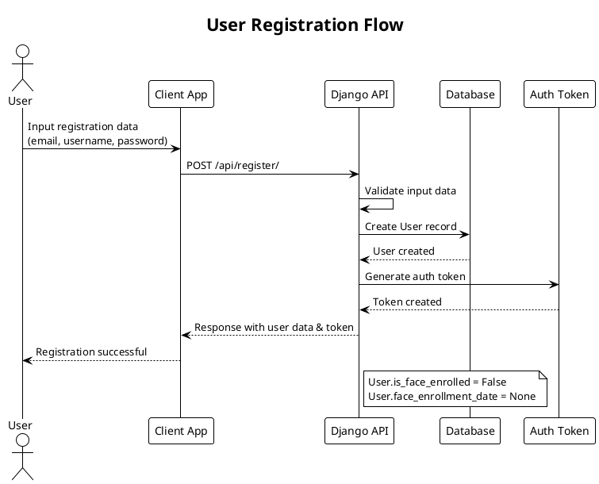
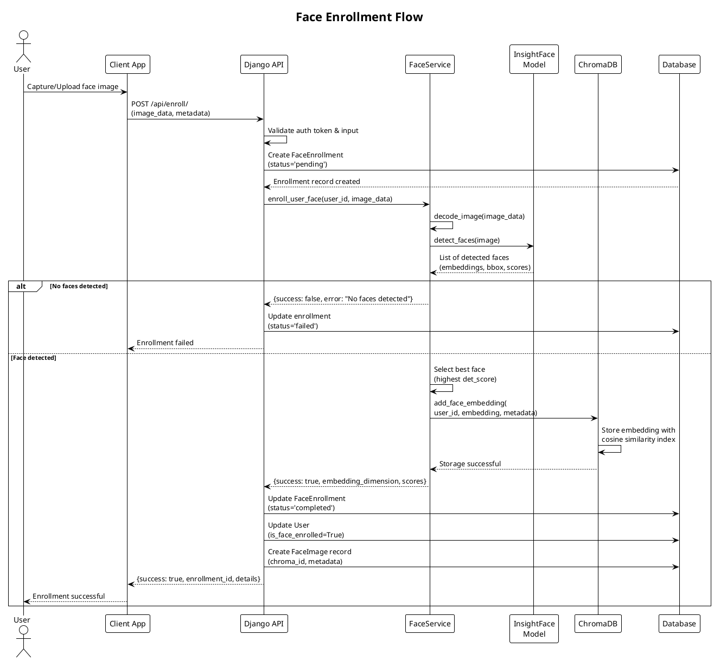
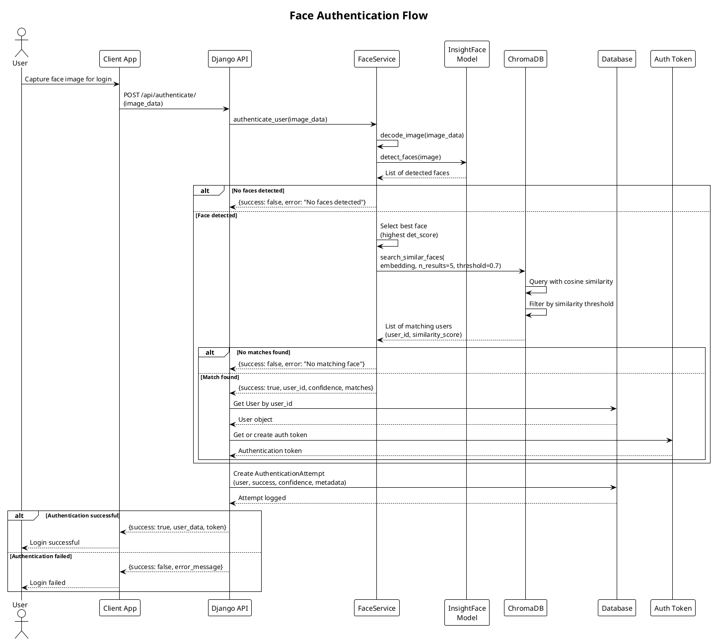
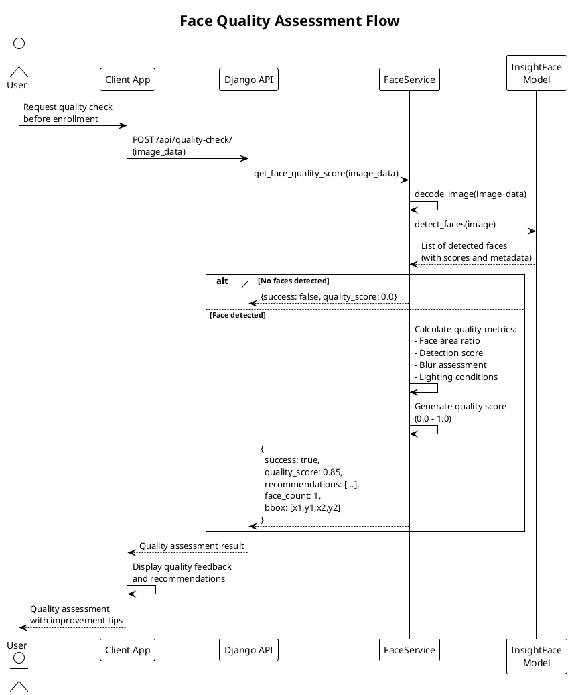
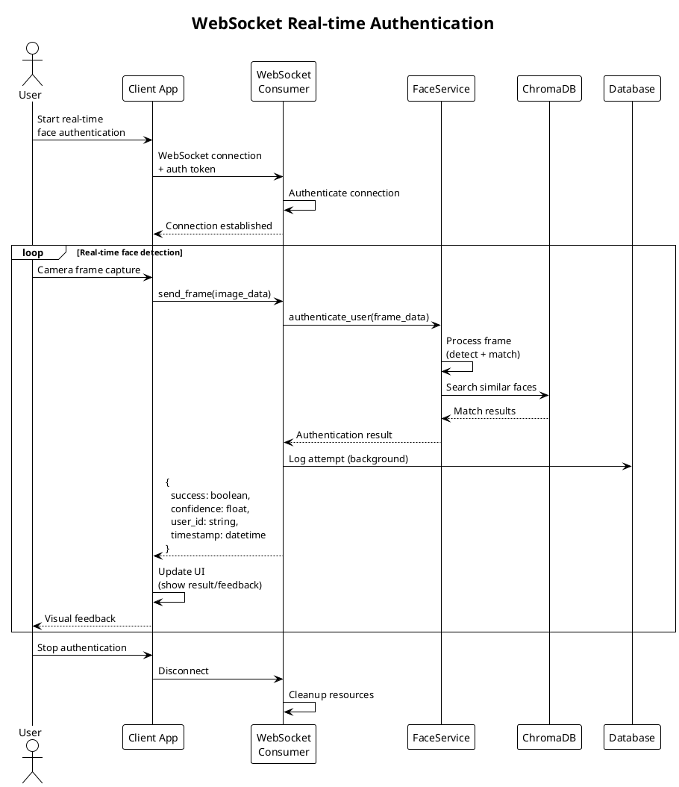
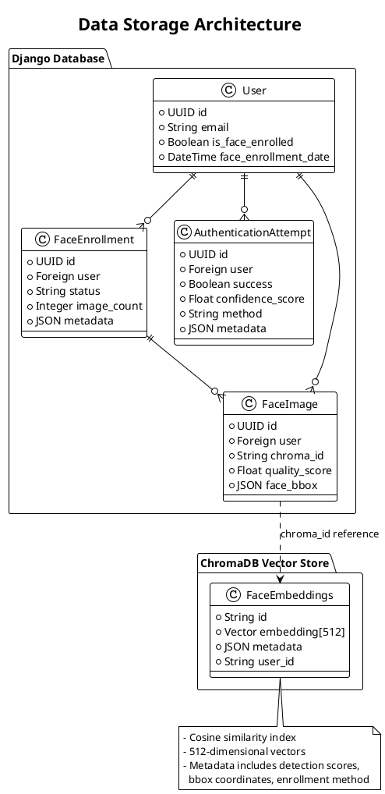

# Face Authentication Application - Technical Flow Documentation

## 1. Arsitektur Sistem

### Komponen Utama:

1. **Django REST Framework** - API Layer
2. **InsightFace Model (buffalo_l)** - Face Detection & Embedding Generation  
3. **ChromaDB** - Vector Database untuk Face Embeddings
4. **PostgreSQL/SQLite** - Metadata Storage
5. **WebSocket** - Real-time Communication (Channels)

### Models:
- **User** - Extended Django User dengan face enrollment status
- **FaceEnrollment** - Track enrollment process
- **AuthenticationAttempt** - Log semua authentication attempts
- **FaceImage** - Metadata gambar dan referensi ke ChromaDB

### Services:
- **FaceRecognitionService** - Handle face detection, encoding, quality assessment
- **ChromaDBService** - Vector similarity search dan storage

---

## 2. Flow Technical - User Registration & Face Enrollment

### 2.1 User Registration Flow

### 2.2 Face Enrollment Flow

---

## 3. Flow Technical - Face Authentication

### 3.1 Face Authentication Flow

---

## 4. Flow Technical - Quality Assessment

---

## 5. WebSocket Real-time Authentication Flow

---

## 6. Data Storage Architecture

---

## 7. Security & Performance Considerations

### Security:
- **Token-based Authentication** untuk API access
- **CSRF Protection** untuk web endpoints  
- **Rate Limiting** untuk mencegah brute force
- **Input Validation** untuk image data
- **Audit Logging** semua authentication attempts

### Performance:
- **ChromaDB Indexing** dengan cosine similarity
- **Async Processing** untuk WebSocket connections
- **Image Quality Assessment** sebelum enrollment
- **Caching** untuk frequently accessed embeddings
- **Background Tasks** untuk logging dan cleanup

### Scalability:
- **Horizontal Scaling** ChromaDB clusters
- **Load Balancing** untuk multiple Django instances  
- **WebSocket Connection Pooling**
- **Database Read Replicas** untuk analytics
- **CDN** untuk static assets
